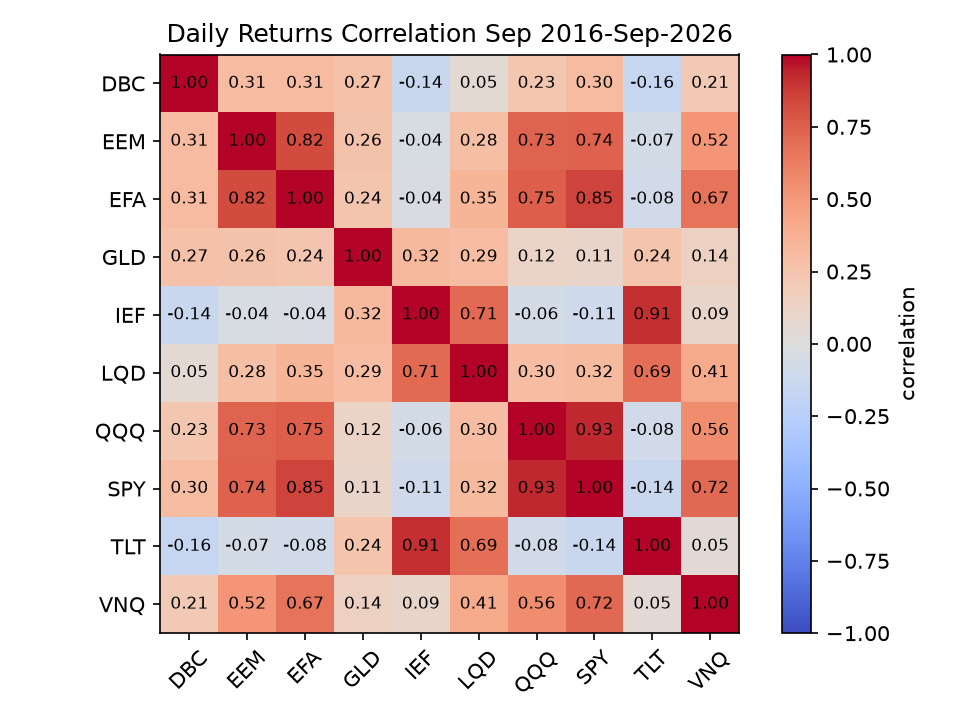
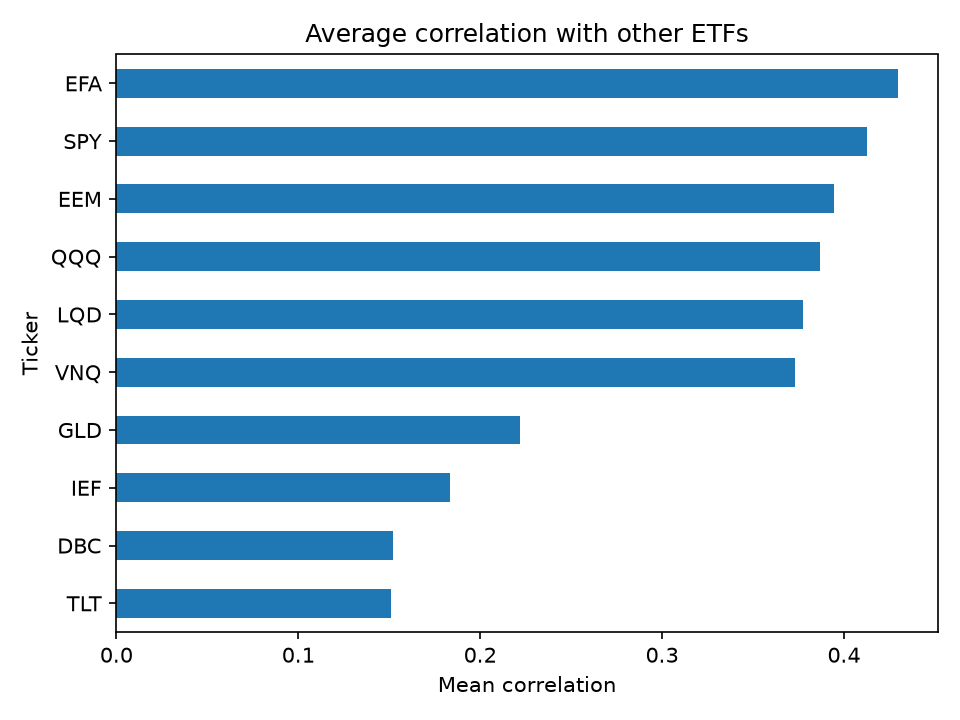
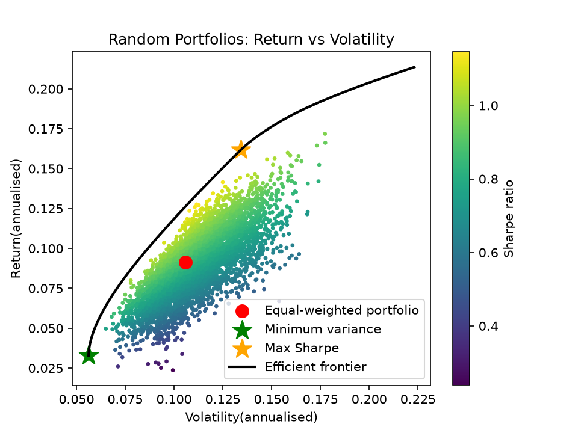
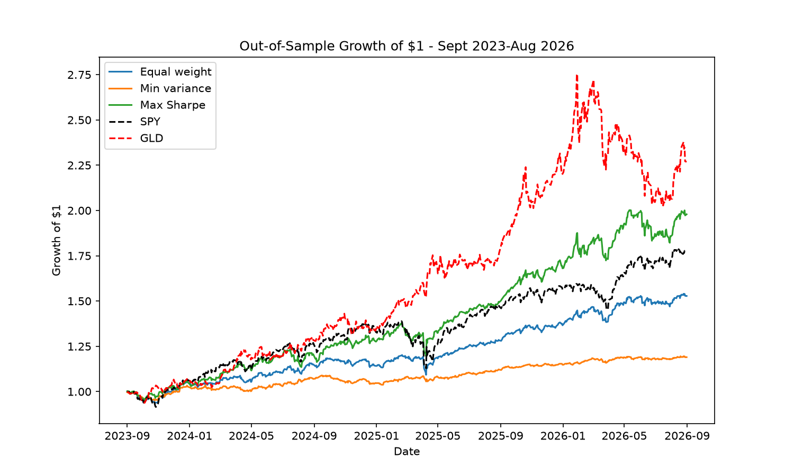

# Portfolio Optimisation

Mean-variance portfolio optimisation on 10 US-listed ETFs, testing whether
optimised portfolios actually outperform a simple equal-weight allocation
once hindsight is removed.

## Key findings

- **Optimisation beats random search:** the max-Sharpe portfolio reached a
  Sharpe ratio of 1.21 in-sample, against 1.15 for the best of 5,000 random
  portfolios. The optimal portfolios are concentrated in a few assets, which
  random sampling rarely produces.
- **The ranking held out-of-sample, but the edge shrank:** optimised on
  2016–2023 and tested on Sept 2023 – Aug 2026, max Sharpe still beat equal
  weight, but its Sharpe advantage fell from 57% in-sample to 12–31%
  out-of-sample. Part of its apparent edge was fitted to noise.
- **The outperformance was partly luck:** max Sharpe held 32% gold for its
  low correlation (gold returned only 6% a year in training), and gold then
  rallied +128% during the test period. The model did not forecast this.
- **Expected returns are the weak point:** min-variance weights (covariance
  only) barely changed between the 7- and 10-year samples, while max-Sharpe
  weights (which also need expected returns) shifted substantially.

## Data

- Daily adjusted close prices from Yahoo Finance (via `yfinance`)
- Period: 1 Sept 2016 – 31 Aug 2026 (10 years, 2,511 daily returns)
- No missing values, so no forward-filling was required
- The window includes two major stress events: the 2020 Covid crash and the
  2022 rate shock

| Ticker | Asset class | Annual return | Annual volatility |
|---|---|---|---|
| SPY | US large-cap equities | 15.9% | 18.0% |
| QQQ | US tech equities | 21.5% | 22.6% |
| EFA | Developed ex-US equities | 10.5% | 17.0% |
| EEM | Emerging markets equities | 10.4% | 20.8% |
| TLT | Long-term US Treasuries | −1.4% | 14.8% |
| IEF | 7–10yr US Treasuries | 0.7% | 6.6% |
| LQD | Investment-grade corporate bonds | 2.4% | 8.7% |
| GLD | Gold | 13.2% | 16.3% |
| VNQ | US real estate (REITs) | 7.0% | 20.8% |
| DBC | Broad commodities | 11.2% | 17.9% |

Returns are annualised as mean daily return × 252; volatility as daily
standard deviation × √252. All returns are in US dollars.

## Correlation analysis

- The equity ETFs are highly correlated with each other (e.g. SPY–QQQ at
  0.93), so holding several offers little diversification.
- SPY–TLT correlation of −0.14: long-term Treasuries still diversified US
  equities over the period, though the relationship was weak. That's likely
  due in part to 2022, when stocks and bonds fell together as rates rose.
- Gold shows low correlation with equities (e.g. 0.14 with SPY), consistent
  with its role as a diversifying asset.

- **Prediction for optimisation:** TLT (0.15) and DBC (0.15) have the lowest
  average correlation with the other ETFs, followed by IEF (0.18) and GLD
  (0.22), while equities cluster at 0.39–0.43. I expected the optimiser to
  lean on bonds, commodities and gold for diversification, and to favour one
  equity ETF over holding several.

## Diversification benefit

An equal-weight portfolio (10% in each ETF) is used as the benchmark.

| Portfolio | Return | Volatility | Sharpe |
|---|---|---|---|
| Equal weight | 9.1% | 10.6% | 0.86 |
| SPY only | 15.9% | 18.0% | 0.88 |

- The equal-weight return is the simple average of the ten ETFs, but its
  volatility (10.6%) is 35% below their average volatility (16.4%). That
  reduction comes purely from imperfect correlations between assets.
- Over this decade, simply holding SPY was slightly better risk-adjusted than
  naive diversification, reflecting the exceptional run in US equities.

## Optimised portfolios (in-sample, full decade)

Optimised with `scipy.optimize.minimize` (SLSQP), long-only (weights between
0 and 1) and fully invested (weights sum to 1).

### Random portfolios (Monte Carlo)

5,000 random long-only portfolios, with weights drawn from a Dirichlet
distribution so that all weight combinations are equally likely. The
equal-weight portfolio (red) sits inside the cloud, showing that better
risk/return combinations exist. The best random portfolio reached a Sharpe
ratio of 1.15, against the optimiser's 1.21: the optimal portfolios are
concentrated in a few assets, which random sampling rarely produces, so even
a large random search falls short.

### Minimum variance

| Return | Volatility | Sharpe |
|---|---|---|
| 3.3% | 5.6% | 0.59 |

Weights: IEF 79.3%, DBC 11.1%, SPY 9.6%, all others 0%.

- Volatility of 5.6% is below even the least volatile single ETF (IEF, 6.6%):
  combining low-correlation assets reduces risk below any one of them alone.
- LQD and TLT receive nothing despite being bonds. Both are more volatile
  than IEF and highly correlated with it, so the optimiser picks the best
  asset from a correlated group and ignores the rest.
- **Prediction partly confirmed:** bonds and commodities were used, but only
  one bond fund, and gold received no weight.
- The result is concentrated (7 of 10 assets at 0%) and has a lower Sharpe
  ratio than equal weight. Minimising risk pushed the portfolio into bonds,
  which had a poor decade.

### Max Sharpe

| Return | Volatility | Sharpe |
|---|---|---|
| 16.2% | 13.4% | 1.21 |

Weights: GLD 43.5%, QQQ 40.0%, DBC 16.5%, all others 0%.

- The optimiser combines the best return-per-risk equity ETF (QQQ) with two
  low-correlation assets (GLD, DBC). SPY is excluded because it's highly
  correlated with QQQ and slightly weaker, confirming the prediction.
- No bonds are held: their near-zero returns over the period make them
  unattractive when maximising return per unit of risk.
- **In-sample caveat:** these weights were chosen with full knowledge of the
  decade. The out-of-sample test below examines whether they hold up.

### Efficient frontier

The frontier shows the minimum volatility achievable for each target return
(50 targets, long-only). It passes through both optimised portfolios, and no
random portfolio lies above it.

## Out-of-sample test

To remove hindsight, the portfolios were re-optimised using only data up to
31 Aug 2023 (training, ~7 years), then held with fixed weights over
1 Sept 2023 – 31 Aug 2026 (test, ~3 years). No test-period data was used to
choose weights.

### Training-period weights

| Asset | Min variance | Max Sharpe |
|---|---|---|
| IEF | 79.8% | 0% |
| DBC | 8.9% | 20.3% |
| SPY | 8.7% | 0% |
| EFA | 2.7% | 0% |
| QQQ | 0% | 47.3% |
| GLD | 0% | 32.4% |

- Min-variance weights were almost identical to the full-decade version,
  because they depend only on covariances, which are relatively stable.
- Max-Sharpe weights shifted substantially (gold 43.5% → 32.4%) because they
  also depend on expected returns, which are far noisier to estimate. Gold's
  training-period return was only 6.1%, against 13.2% over the full decade.
- Gold still received a large weight despite its modest return, because its
  low correlation with QQQ and DBC reduced portfolio volatility. I had
  predicted its weight would fall much further; the prediction focused on
  return and underestimated the role of correlation.

### Results

| Portfolio | In-sample Sharpe | OOS return | OOS vol | OOS Sharpe (rf=0) | OOS Sharpe (rf=T-bill) | Max drawdown |
|---|---|---|---|---|---|---|
| Equal weight | 0.62 | 14.7% | 9.7% | 1.51 | 1.06 | −9.1% |
| Min variance | 0.35 | 6.0% | 5.5% | 1.09 | 0.29 | −4.7% |
| Max Sharpe | 0.97 | 23.9% | 14.1% | 1.70 | 1.39 | −13.2% |

In-sample = training weights evaluated on training data. OOS = the same
weights evaluated on the test period. The T-bill rate is the average 3-month
US Treasury bill rate over the test period (~2.35%).

- **The ranking held** (max Sharpe > equal weight > min variance), but every
  portfolio's Sharpe was higher out-of-sample than in-sample. This points to
  an unusually strong test period rather than skill.
- **Max Sharpe's advantage shrank:** its Sharpe was 57% above equal weight
  in-sample, but only 12–31% above it out-of-sample. Part of the edge the
  optimiser expected was fitted to noise in the training data.
- **Gold drove the late outperformance:** max Sharpe tracked SPY until late
  2025, then pulled ahead as gold rallied (GLD +128% over the test period).
  Because its gold weight was chosen for diversification, not forecast
  returns, this outperformance was not predicted by the model. When gold
  fell ~25% from its early-2026 peak, the other holdings limited the damage.
- **Accounting for cash changes the min-variance story:** its Sharpe fell
  from 1.09 to 0.29 with a realistic risk-free rate. It returned 6.0% when
  T-bills paid ~2.35%, so it took on risk to earn little more than cash.
- **Drawdowns scaled with return,** and all three portfolios fell less than
  SPY (−18.8%). Over the test period, max Sharpe grew $1 to ~$1.98 against
  ~$1.77 for SPY, with a smaller maximum drawdown.

## Assumptions and limitations

- In-sample Sharpe ratios assume a risk-free rate of 0. Rates were much lower
  in 2016–2023 than in the test period, so this matters less in-sample.
- Weights are held fixed and implicitly rebalanced daily, with no
  transaction costs.
- Returns are in US dollars; exchange-rate effects for a non-US investor are
  not modelled.
- Long-only, with no limits on individual weights, which produces
  concentrated portfolios.
- A single train/test split: one 3-year test period is a single sample, so
  these results should not be generalised.
